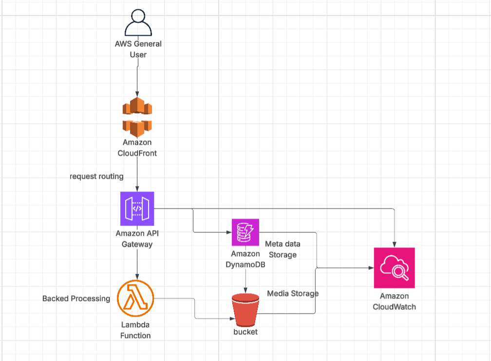
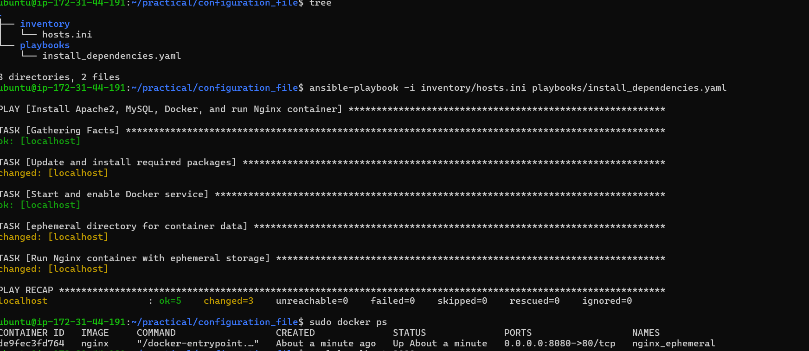
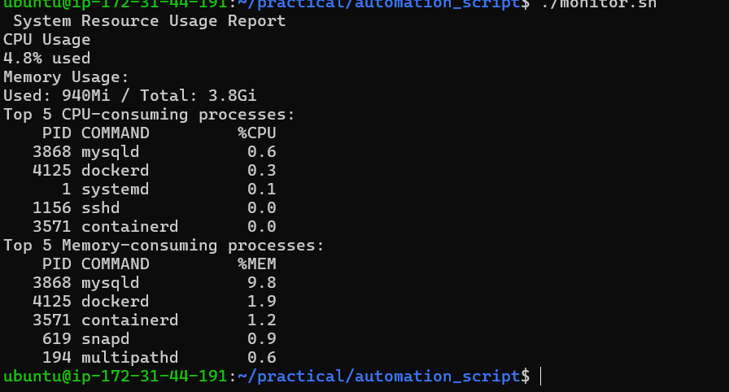
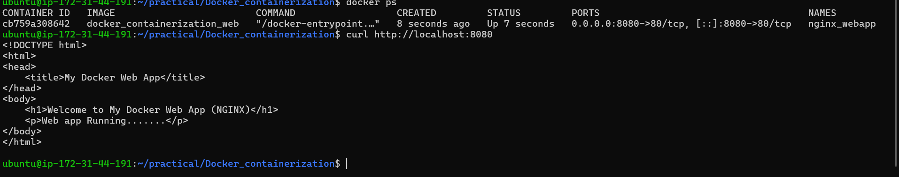

# SOLVATIVE TASKS 

Task 1 : media streaming application

********************************************************************************************************************************************

Task 2 : Ansible playbook to install dependencies

********************************************************************************************************************************************

Task 3 : monitoring and sql backup 

********************************************************************************************************************************************

Task 4 : sample web application using nginx

